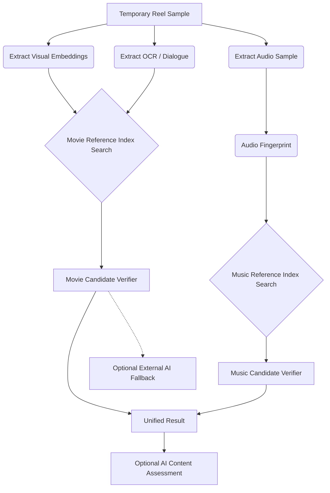

# Reelix Recognition Architecture

## 1. Problem Definition
The core challenge for Reelix is identifying a movie or TV series from a very short, potentially degraded screen recording (a social-media "Reel"). A raw 5-second screen recording is large, contains UI overlays, and does not carry original file metadata. Reelix needs a fast, privacy-preserving, and cost-effective way to match this partial evidence against a vast universe of possible titles.

## 2. Candidate Approaches

### Approach A: Multimodal AI (External Provider)
- **Concept**: Send frames, OCR text, and audio to an external AI model (e.g., Gemini, GPT-4o) and ask it to guess the movie.
- **Pros**: Requires no local movie database. Fast to prototype.
- **Cons**: High hallucination risk. Struggles with exact scene/episode identification. Expensive per-scan at scale. Requires sending user screen captures to a third party.

### Approach B: Pure Licensed Reference Index (ACR)
- **Concept**: Partner with an Automatic Content Recognition provider or build a massive index of full movies.
- **Pros**: Highly accurate. Deterministic.
- **Cons**: Extremely expensive. Complex licensing and copyright issues.

### Approach C: Hybrid Architecture (Recommended)
- **Concept**: Extract compact fingerprints (visual and audio) and OCR text locally. Search a Reelix-owned index of mathematical representations. If the index yields no confident match, optionally fall back to an external AI service.
- **Pros**: Fast and cheap for popular/indexed titles. Better exact-scene matching. Less dependency on expensive third-party APIs. Respects near-zero budget constraints by allowing incremental index building.

## 3. Recommended Hybrid Architecture

## 3. Recommended Hybrid Architecture

The target recognition flow for the Reelix application is:

MOVIE / TV recognition should evaluate:
- visual embeddings
- FAISS/vector search
- OCR/subtitle evidence
- dialogue/audio evidence where useful
- reference-index matching
- NO_MATCH handling

MUSIC recognition should evaluate:
- short playback-audio sample
- acoustic/audio fingerprint
- fingerprint matching
- title, artist, optional album metadata

## 4. Visual Fingerprinting Strategy
- **Representation**: Short video frames must be represented as compact visual embeddings (e.g., 512-dimensional float vectors) rather than raw JPEGs.
- **Comparison**: Query frames are compared against indexed reference frames using vector similarity (e.g., cosine similarity or L2 distance).
- **Candidate Technologies**: OpenCLIP or lightweight MobileNet models for generating embeddings. FAISS or `pgvector` for similarity search.
- **Local Development**: Embeddings can be generated locally using open-source models without any cloud API costs.

## 5. Audio Fingerprinting Strategy
- **Mechanism**: Spectrogram analysis generates an audio "fingerprint" or hash for short clips, which is robust to slight timing shifts or noise.
- **Utility**: Highly useful for matching exact scenes when the original soundtrack or dialogue is intact.
- **Limitations**: Android apps targeting Android 10+ allow playback capture, but the source app (e.g., Netflix) can block it. Social media reels often replace original audio with trending music.
- **Degradation**: Reelix must degrade gracefully. If audio cannot be captured, the system relies entirely on visual fingerprints and OCR.

## 6. OCR / Text Matching Strategy
- **Utility**: Subtitles, captions, and on-screen text are powerful supporting evidence. A recognized character name or unique quote can instantly narrow down candidates.
- **Implementation**: Use local OCR (e.g., Tesseract or Android ML Kit) to extract text on the device.
- **Role**: OCR is treated as supporting evidence to filter or boost vector search results, not as the sole recognizer.

## 7. Reference Index Design
Reelix's future index will **never** store full movies. It will store compact mathematical representations and metadata:

- Visual embeddings (vectors)
- Audio fingerprints (hashes)
- Dialogue/subtitle tokens
- Movie/Series ID (mapped to TMDB)
- Season/Episode IDs
- Timestamps

**Early Development Storage Options (Zero Budget)**:
- **FAISS**: Local vector similarity search library.
- **SQLite / JSON**: For mapping IDs to titles locally.
- **Local PostgreSQL**: Using `pgvector` for a more robust local development database.

*No paid cloud infrastructure will be activated during the prototype phase.*

## 8. Legal and Content Acquisition Strategy
**Critical Limitation**: Reelix cannot legally scrape or download copyrighted movies from streaming platforms to build a commercial database.

**Lawful Strategies**:
- **Prototype**: Use owned media, public domain films, or Creative Commons content to test the recognition pipeline.
- **Commercial Scaling**: The app can launch with a limited catalogue (e.g., highly requested titles) mapped via legal trailers or negotiated metadata partnerships, gradually expanding based on user "Request this title" feedback.

## 9. Future AI Fallback and Security Boundary
External AI (like Gemini) is **optional** and replaceable.
- If implemented later, the user will **never** be required to enter API keys.
- All provider credentials will live securely behind a Reelix-owned backend proxy.
- The backend handles rate-limiting, normalization, and verification.

## 10. Cost Considerations
The hybrid approach minimizes costs by resolving popular queries against a cheap, fast database (the Reelix index) rather than calling an expensive multimodal API for every scan.

## 11. Unresolved Technical Decisions
1. The exact embedding model to use for visual fingerprints (balance between accuracy and processing speed).
2. The specific audio fingerprinting algorithm (e.g., Chromaprint/Echoprint).
3. How to efficiently sync the local/remote index as the catalogue grows.

## 12. Recommended First Technical Experiment
**Goal**: Validate the core Visual Fingerprint + FAISS architecture locally.

**Experiment Steps**:
1. Take 5 public domain / legally obtained short video clips.
2. Write a Python script to extract frames and generate visual embeddings (e.g., using a small open-source CLIP model).
3. Store these embeddings in a local FAISS index.
4. Take a slightly altered "Reel" version of one of those clips (cropped/compressed).
5. Extract its frames, generate an embedding, and query the FAISS index.
6. Check if the correct original clip is returned as the Top-1 result.

*Note: This experiment requires **zero paid APIs**, **zero API keys**, and runs entirely locally.*
